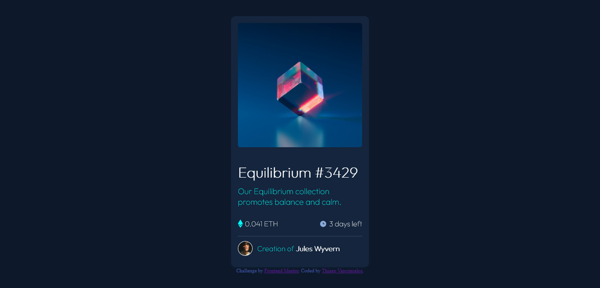

# Frontend Mentor - NFT preview card component

## Welcome! 👋

Thanks for checking out this front-end coding challenge.

[Frontend Mentor](https://www.frontendmentor.io) challenges help you improve your coding skills by building realistic projects.

**To do this challenge, you need a basic understanding of HTML and CSS.**

## The challenge

The challenge is to build out this preview card component and get it looking as close to the [design](Challenge01-NftPreviewCard/design/) as possible.

You can use any tools you like to help you complete the challenge. So if you've got something you'd like to practice, feel free to give it a go.

## Table of contents

- [Overview](#overview)
  - [The challenge](https://www.frontendmentor.io/challenges/nft-preview-card-component-SbdUL_w0U)
  - [Screenshot](#screenshot)
- [My process](#my-process)
  - [Built with](#built-with)
  - [What I learned](#what-i-learned)
  - [Continued development](#continued-development)
  - [Useful resources](#useful-resources)
- [Author](#author)

## Overview

### The challenge

Users should be able to:

- View the optimal layout depending on their device's screen size
- See hover states for interactive elements

### Screenshot

### Links

- Solution URL: [Add solution URL here](https://your-solution-url.com)
- Live Site URL: [Add live site URL here](https://your-live-site-url.com)

## My process

I started to analyze what the challenge asked for in order to be able to divide this big problem into smaller ones like creating variables for the main colors and neutral tones and I continued until I developed a satisfactory solution with my real knowledge in this area

### Built with

- Semantic HTML5 markup
- CSS custom properties
- Flexbox

### What I learned

i learned a lot about css units, i used to just use px but now i see the importance of other units, this challenge was very important for flexbox practice, content splitting and active states

### Continued development

i still an active state to complete, i managed to find solutions for such problem on youtube and github but i don't want to copy code but develop my own solution when i'm able to do so

### Useful resources

- [Adobe colors](https://color.adobe.com/pt/create) - When the project doesn't provide you with the desired color palette this site will help you for sure.
- [Palleton](https://paletton.com/#uid=1000u0kllllaFw0g0qFqFg0w0aF) - It will help you just like the adobe colors
- [Google Fonts](https://fonts.google.com/) - Best website for font searching.
- [W3schools](https://www.w3schools.com/cssref/css_units.asp) - CSS units

## Author

- Instagram - [@_thiagosav](https://www.instagram.com/_thiagosav/)
- Frontend Mentor - [@thiagovasc](https://www.frontendmentor.io/profile/Thiagovasc)
- Github - [@thiagovasc](https://github.com/Thiagovasc)